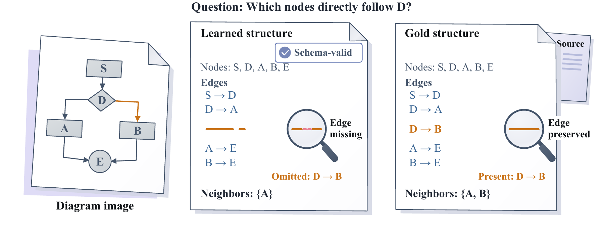
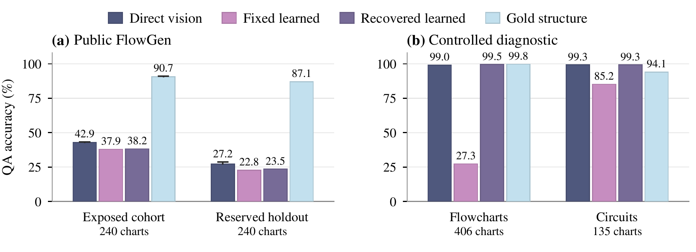
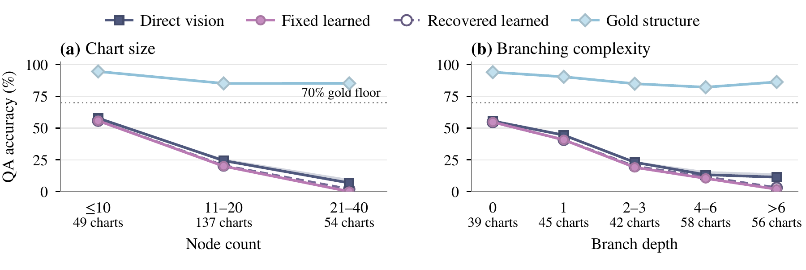

# When Can Text Replace Vision? Structural Bottlenecks in Diagram Reasoning

<p align="center"><strong>Yunbei Zhang · Janet Wang · Jihun Hamm · Chandan K. Reddy</strong></p>

[](https://arxiv.org/abs/2609.39142)
[](#to-do)
[](#to-do)

## To-do

- [ ] Release code
- [ ] Release data
- [x] ~~Release paper on arXiv~~

## Overview

**Useful supplied text does not guarantee successful text-for-vision substitution.** A diagram transcription can be schema-valid yet omit the relation needed to answer a question. Conversely, a solver can fail to use information that is present. This paper studies both sides of that problem: acquiring useful structure and reasoning over it.



*An illustrative example, not a recorded model output: keeping every node is insufficient when an answer-critical edge is missing.*

We compare three input conditions while holding the solver model and generation settings fixed:

| Condition | Solver input | What it tests |
| --- | --- | --- |
| **Direct vision** | Original image and question | Reasoning directly from the diagram |
| **Learned text** | Question-blind structure extracted from the image, plus the question | Utility of the image-to-text pipeline |
| **Gold structure** | Structure derived from the diagram source, plus the question | Utility of supplied source structure |

The text-only solver receives no image. The extractor receives no question or answer. Validity-triggered recovery, question-relevant fidelity, and matched edge interventions provide complementary diagnostics.

## Main results

### 1. Validity recovery does not close the public QA gap

On the reserved **240-chart, 720-question FlowGen holdout**, gold structure reaches **87.1%** QA, while direct vision and learned text remain below 30%. Recovery makes nearly every extraction schema-valid but improves learned QA by only **0.7 percentage points**.

| Input condition | Solver | Schema-valid charts / 240 | Correct / 720 | Missing responses | QA (%) |
| --- | --- | ---: | ---: | ---: | ---: |
| Direct vision | 122B | Not applicable | 196 | 11 | 27.2–28.8 |
| Fixed learned text | 122B | 196 | 164 | 0 | 22.8 |
| Recovered learned text | 122B | 238 | 169 | 0 | 23.5 |
| Gold structure | 122B | Not applicable | 627 | 0 | **87.1** |
| Same fixed learned text, secondary arm | 27B | 196 | 157 | 0 | 21.8 |

All holdout arms use an **8,192-token solver output cap**. Fixed extraction uses a **1,024-token output cap**. Invalid acquisitions count as QA failures; the direct-vision range bounds its 11 missing responses and is not a confidence interval. The 122B model is **Qwen3.5-122B-A10B**, a mixture-of-experts model with approximately 10B active parameters; the secondary solver is Qwen3.5-27B.



*The exposed and held-out public cohorts are separate, each with 240 charts and 720 questions. Whiskers bound missing outcomes, not sampling uncertainty. Controlled recovery is a post-confirmation diagnostic on 406 program flowcharts and 135 Boolean circuits; the earlier controlled confirmation was mixed and ceiling-limited.*

Recovery escalates extraction caps from **1,024 → 2,048 → 8,192 only when validity fails**, followed by versioned normalization and one bounded retry. Already-valid extractions are unchanged. The result concerns this recovery policy, not uniform high-budget re-extraction or semantic refinement.

**Interpreting the comparison.** Learned and gold inputs use different graph encodings, and some source-derived relation targets are not printed in the image. The aggregate gap therefore includes source-annotation access and representation–solver compatibility; it is not a pure estimate of image-extraction error. The deficit also appears on neighbor questions: gold versus fixed learned QA is 86.0% versus 25.3% for incoming neighbors and 94.6% versus 23.5% for outgoing neighbors.

### 2. The learned–gold deficit grows with structural difficulty

The deficit grows from **38.8 to 85.2 percentage points** between charts with at most 10 nodes and charts with 21–40 nodes. Both prespecified node-count and branch-depth trends confirm after multiplicity adjustment. Recovery barely changes this pattern.



*Lines connect prespecified bins, not fitted curves; direct shading shows missing-outcome bounds. Every occupied structural bin exceeds the 70% gold floor. These are observational trends under the tested source-derived questions and encodings, not causal effects of adding a node or branch. The exploratory shortest-path family has gold QA below the floor and does not support the main family-level structural-gap interpretation.*

### 3. Answer-relevant structure predicts success better than whole-graph matching

Restricting **directed topology exact match** to question-relevant structure improves QA prediction on the same cases and chart-held-out folds. Lower out-of-fold Brier loss is better; the primary topology comparison has a multiplicity-adjusted interval excluding zero.

| Extraction | Metric | Questions | Whole-graph Brier loss | Relevant-structure Brier loss |
| --- | --- | ---: | ---: | ---: |
| Fixed | Topology exact, primary | 588 | 0.1406 | **0.1147** |
| Fixed | Edge F1, secondary | 588 | 0.1305 | 0.1240 |
| Recovered | Topology exact, secondary | 714 | 0.1242 | 0.1058 |
| Recovered | Edge F1, secondary | 714 | 0.1165 | 0.1134 |

Source-derived relevance masks are used only for evaluation, never provided to the extractor or solver. The matched edge-F1 comparisons do **not** establish an improvement; their paired intervals cross zero.

### 4. Error location matters in matched interventions

For the primary 122B solver, changing one answer-relevant edge reduces **original-answer accuracy** to 0–3.5%, while matched irrelevant edits preserve more than 92% accuracy.

| One-edge edit | Charts | Questions | Relevant edit: QA (%) | Irrelevant edit: QA (%) |
| --- | ---: | ---: | ---: | ---: |
| Reverse | 60 | 172 | 3.5 | 92.4 |
| Drop | 50 | 148 | 0.0 | 93.9 |
| Redirect | 50 | 148 | 0.0 | 93.2 |

This is an **exposed mechanism experiment at a 512-token solver cap**, not the holdout setting. Relevant edits deliberately change the original answer; irrelevant edits preserve it, and both are scored against the original answer. The contrast measures sensitivity to selected corruption, not correctness on the modified graph or how much of the natural acquisition gap these errors explain. The direction also holds for 4B and 27B, although 4B is less accurate even under irrelevant edits.

### 5. Supplied structure saves solving tokens; acquisition changes the trade-off

Gold structure uses **81.8% fewer solving tokens** than direct vision. Including acquisition and failed attempts makes learned text more token-intensive at single use. Reusing a representation across three questions lowers token usage, but neither learned policy meets the predeclared comparable-accuracy margin.

| Input | QA (%) | Tokens / question, K = 1 | Tokens / question, K = 3 |
| --- | ---: | ---: | ---: |
| Direct vision | 27.2–28.8 | 6,423 | 6,423 |
| Fixed learned text | 22.8 | 7,551 | 3,201 |
| Recovered learned text | 23.5 | 10,413 | 4,397 |
| Gold structure | 87.1 | 1,169 | 1,169 |

K is the number of questions sharing one representation. Only acquisition is amortized; the answers and representations are unchanged. Gold excludes acquisition cost. These are model-native token counts, not dollar or hardware-controlled compute savings. Comparable accuracy requires the lower paired 95% text-minus-direct bound to exceed −2 percentage points.

On identical fixed learned inputs, the secondary 27B-minus-122B holdout difference is −0.97 percentage points, with a 95% interval of [−2.22, 0.28]. This does not establish a solver ranking: representation–solver compatibility remains a secondary result.

## Scope

The confirmatory evidence covers one FlowGen renderer (*Diagrams*), mechanically generated source-based questions, and one model family. Controlled recovery and exposed perturbations serve different diagnostic roles and are not additional holdout confirmations. Query-conditioned outputs are excluded from confirmation. The main lesson is to evaluate acquired text by the answer-relevant evidence it preserves, the solver's ability to use that representation, and the full cost of acquiring it.

## Citation

```bibtex
@misc{zhang2026textforvision,
  title         = {When Can Text Replace Vision? Structural Bottlenecks in Diagram Reasoning},
  author        = {Zhang, Yunbei and Wang, Janet and Hamm, Jihun and Reddy, Chandan K.},
  year          = {2026},
  eprint        = {2609.39142},
  archivePrefix = {arXiv},
  primaryClass  = {cs.CV},
  url           = {https://arxiv.org/abs/2609.39142}
}
```
